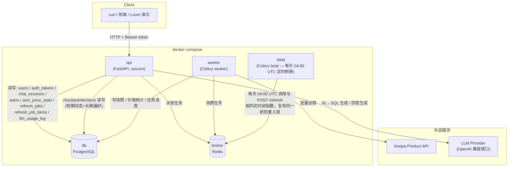
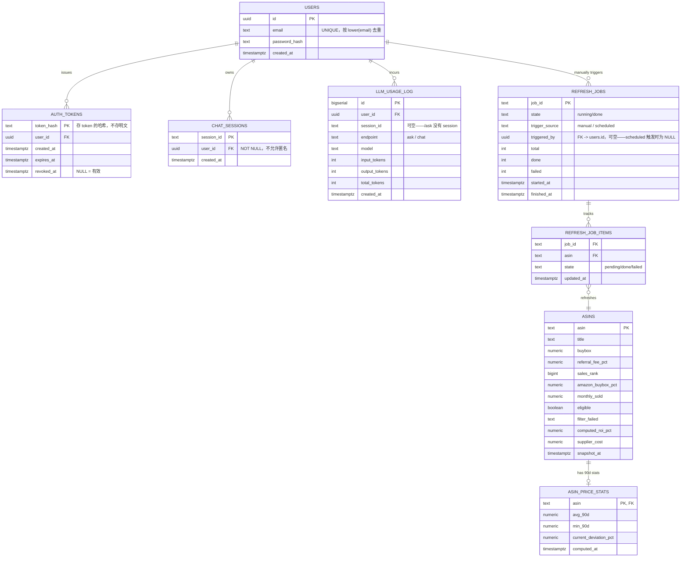
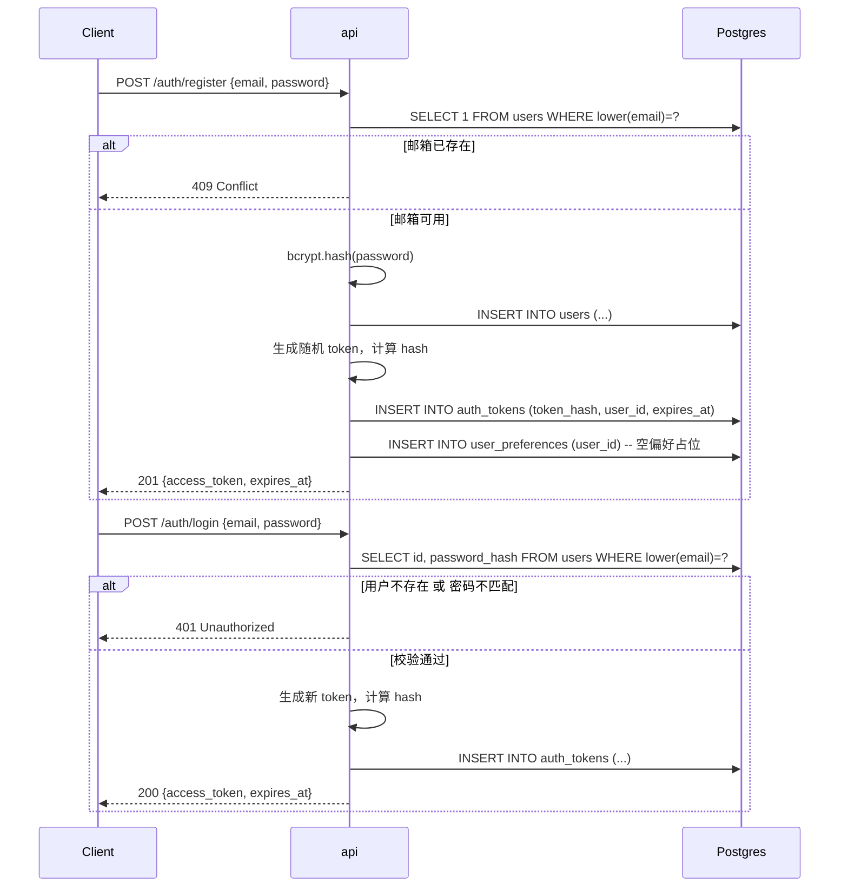
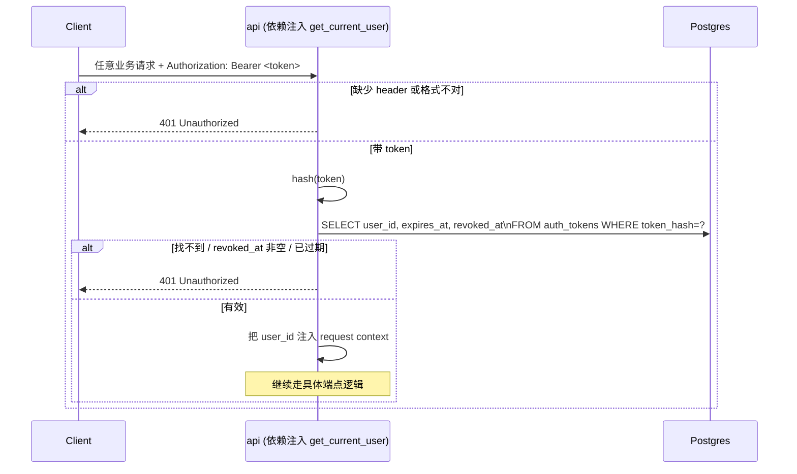
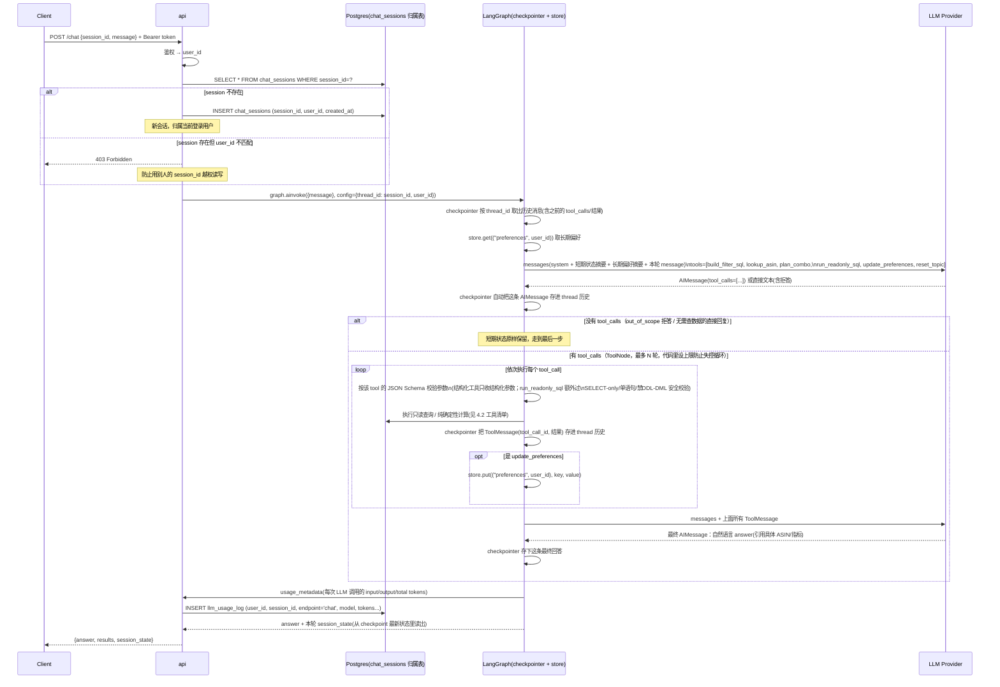
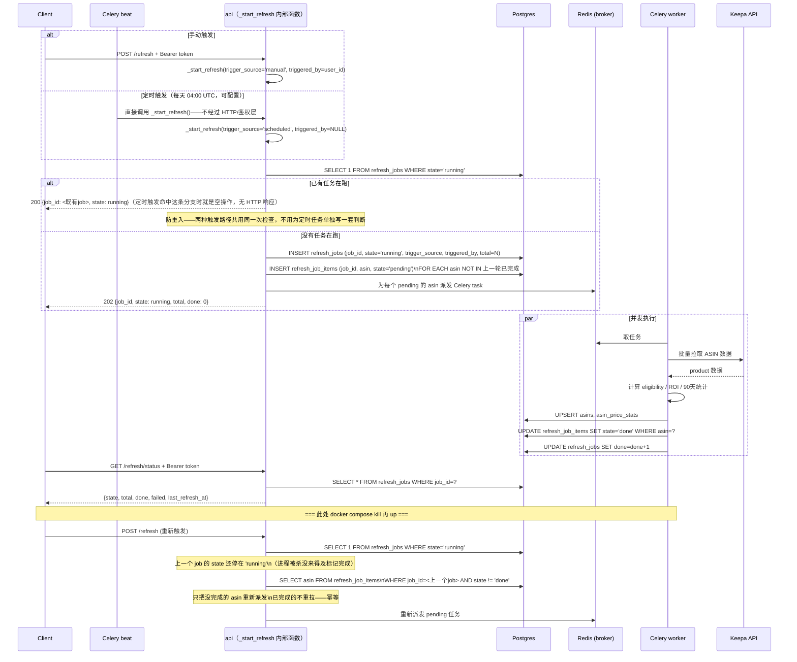

# Architecture — Keepa Scout

设计文档，不含实现代码。覆盖：系统部署架构、数据模型关系、核心流程时序图。

> **对 CHALLENGE.md 的一处偏离，先说清楚**：题目给的 `/upc`、`/eligibility`、`/ask`、
> `/chat`、`/refresh` 等 curl 示例都不带 `Authorization` header。本设计决定加**强制鉴权**、
> **不做匿名回退**——意味着所有业务端点都必须先 `POST /auth/register` + `POST /auth/login`
> 拿到 token 才能调用。README 里的 curl 示例会相应地在最前面加一步"注册/登录拿 token"。
> 这是主动做的产品化决策，超出题目字面要求，会在 REPORT.md 里作为"额外做了什么、为什么"写清楚。

---

## 1. 系统部署架构



**职责边界**：
- `api` 只做请求校验、鉴权、读写 DB、把耗时的全量刷新甩给 Celery——不在请求线程里跑长任务
- `worker` 是唯一真正调用 Keepa 批量接口的地方（`/refresh` 触发的全量刷新);`/upc`、`/eligibility`
  这种单次查询由 `api` 直接同步调 Keepa（延迟可接受，不需要排队)
- **断点续跑的真相源在 Postgres 的 `refresh_job_items`，不在 Redis**——即使 broker 数据丢失，
  依然能从 DB 里查出哪些 ASIN 还没完成本轮刷新
- **`beat` 不是一条独立的业务逻辑**，它只是定时调用 `POST /refresh` 背后同一个"启动刷新任务"的
  内部函数——防重入检查（是否已有 `state=running` 的 job）天然复用，不用为定时任务单独写一套判断；
  如果 04:00 UTC 时手动触发的刷新还没跑完，beat 这次触发就是空操作（等价于并发 `POST /refresh`）

---

## 2. 数据模型关系（ER）



**关键约束**：
- `chat_sessions.user_id` **NOT NULL**——没有匿名会话，一个 session 必须属于一个登录用户
- `chat_sessions` 现在**只做归属校验**（这个 session_id 是不是这个 user 的），不再存
  `active_filters`/`last_result_asins` 等短期状态——那些字段连同完整的消息/工具调用记录，改由
  **LangGraph 的 Checkpointer**（`AsyncPostgresSaver`，按 `thread_id = session_id`）自动持久化，
  它会在同一个 Postgres 实例里自建 `checkpoints`/`checkpoint_writes`/`checkpoint_blobs` 表，
  本图不重复建模那几张表（细节见 §4）
- 长期偏好（`budget_per_unit`/`excluded_asins`）不再是这里的 `user_preferences` 表，改由
  **LangGraph 的 Store**（`AsyncPostgresStore`，`namespace=("preferences", user_id)`）持有——
  这是 §4 调研后定的：Store 天然按 user_id 分区、跨 thread，跟我们要的"长期记忆"语义完全对上，
  没必要再手动维护一张会跟 Store 打架的重复表
- **`/ask` 不查用户偏好**——`/ask` 的 SQL 生成只面向 `asins`/`asin_price_stats`，偏好类问题
  （"我的预算是多少"）走 `/chat` 由 agent 通过 Store 回答；这条把 §4 留下的开放问题定了，Store
  是唯一数据源，不做 SQL 可查的镜像表，避免两个来源打架
- `auth_tokens` 存的是 token 的哈希（如 SHA-256），不存明文——DB 泄露不等于 token 泄露；原始
  token 只在签发那一刻返回给客户端一次
- `refresh_jobs.triggered_by` 可空——手动 `POST /refresh` 时记触发人，`beat` 每天 04:00 UTC
  定时触发时为 NULL、`trigger_source='scheduled'`，用于审计"这次刷新是谁/什么触发的"，不代表
  权限限制（见下方"角色"备注）
- **没有角色/权限系统**——任何登录用户都能触发 `/refresh`，这是有意的范围限制（这是单人评审的
  take-home，不是多租户 SaaS），`triggered_by` 只做审计，不做权限校验；写进 REPORT.md"故意没做
  好的地方"清单

---

## 3. 核心流程

### 3.1 注册 + 登录



### 3.2 受保护端点的统一鉴权（所有业务端点都走这一步）



**受保护范围**：除 `POST /auth/register`、`POST /auth/login` 外，`/upc`、
`/eligibility/{asin}`、`/eligibility/batch`、`/ask`、`/chat`、`/refresh`、
`/refresh/status` 全部要求这一步通过。

### 3.3 `/chat`——短期记忆 + 长期偏好 + 工具调用记录如何合并进一次回答



**为什么这样才对**：上一版里 `build_filter_sql`/`lookup_asin`/`plan_combo` 是代码在"猜"到某个 intent
之后自己悄悄调用的，LLM 并不知情，消息记录也没地方存——等于对话里发生了什么只有代码自己知道，
回放/审计/调试都做不到。现在这些操作全部包装成 LLM 原生 `tool_calls`，模型自己决定调不调、调哪个、
传什么参数；持久化这部分不用我们手写表和 INSERT 语句了——LangGraph 的 checkpointer 会把
"user → assistant(tool_calls) → tool(结果) × N → assistant(最终回答)" 这条完整链路自动按
`thread_id` 存进 Postgres，可以整段回放，我们只需要在 `chat_sessions` 里管住"这个 thread 是谁的"
这一件事。

### 3.4 `/refresh`——防重入 + 断点续跑



---

## 4. Agent / LLM 编排技术

### 4.1 结论先行：不用 Agent 框架，用原生 tool calling，且每次调用都要落库

不上 LangChain / CrewAI / AutoGen 这类框架。理由：

- 这里的"agent"行为边界很窄（一组固定工具、每轮最多 N 次工具调用），框架的价值（管理成百
  上千工具、多 agent 交接）用不上，只会带来版本抖动和调试黑盒
- 工具的参数校验、SQL 安全校验必须是**确定性代码、每次都跑**，不能依赖框架内部"决定要不要
  校验"的黑盒逻辑——控制力不够
- 手写的 loop 更容易在 Loom 里逐行讲清楚（题目要求"仓库里每一个文件都要讲得清"）
- **对话里发生的每一步都必须是可回放的**——LLM 决定调用哪个工具、传了什么参数、工具返回了
  什么，这些不能只存在于一次函数调用的调用栈里，必须是 `chat_messages` 里一条独立的记录
  （`role=assistant` 带 `tool_calls`，`role=tool` 带 `tool_call_id`+结果）。这是对上一版设计
  的修正——之前把 `build_filter_sql`/`lookup_asin`/`plan_combo` 写成代码在猜出 intent 后自己
  悄悄调用，LLM 并不"知道"这些调用存在，消息表里也没有记录，等于对话的推理链路丢了一段，
  没法审计/回放/在多轮工具调用时把上一步结果正确带给下一步。

技术选型：LLM 提供商的**原生 `tools` / function-calling API**——模型自己决定要不要调用、
调哪个、传什么参数（不是代码替它决定），工具参数按 JSON Schema 强制校验，校验失败/字段
缺失时**代码里把错误反馈给模型重试一次**（不是让模型自己决定要不要重试），超过重试次数
直接判定该轮解析失败，走兜底话术，不假装成功。

### 4.2 工具清单——LLM 能"做"的每一件事都是一个具名、带 Schema、会被记录的工具

| 工具 | 参数（结构化，不接受原始 SQL） | 实现 | 会话状态影响 |
|---|---|---|---|
| `build_filter_sql` | `min_roi?`, `eligible_only?`, `max_amazon_pct?`, `max_supplier_cost?`, `sort?`, `limit?` | 代码按模板拼 SQL 执行（只读） | 合并/替换进 `active_filters`，刷新 `last_result_asins` |
| `lookup_asin` | `asin?` 或 `reference: {ordinal?, pronoun?}` | 代码解析 reference（用 session 的 `last_result_asins`/`resolved_entity`），查详情 | 更新 `resolved_entity` |
| `plan_combo` | `budget`, `diversify_categories?`, 其余约束 | 代码跑贪心/背包算法，纯确定性 | 不改 filters，只影响这轮回答内容 |
| `run_readonly_sql` | `sql: string` | **唯一接受原始 SQL 的工具**；代码过 SELECT-only/单语句/禁 DDL-DML 校验后执行 | 视查询内容可能刷新 `last_result_asins` |
| `update_preferences` | `budget_per_unit?`, `exclude_asin?`, `note?` | `store.put(("preferences", user_id), ...)`，替换/追加语义见 HARNESS.md §7.1 | 不改短期状态，改的是长期偏好（跨 session 生效） |
| `reset_topic` | 无参数 | 清空 `active_filters`/`last_result_asins`/`resolved_entity` | 短期记忆清零 |

**分工原则不变，只是落实方式变了**：凡是能算准的（SQL 怎么拼、组合怎么选、指代怎么解析、
价格异常怎么判断）都在工具的**代码实现**里，不让 LLM 自己算；LLM 负责的是"这轮该不该调用
工具、调哪个、传什么参数"以及"看到工具结果后怎么讲人话"。区别在于：这个决策过程现在是显式
的 `tool_calls`，不是代码从自由文本里猜出来的隐藏 intent。

`run_readonly_sql` 是全仓库里**唯一**接受原始 SQL 文本的工具，`/ask` 和 `/chat` 的开放式分析
问题共用它；其余工具只接受结构化参数，把"安全校验"这个高风险面收窄到一个入口。

### 4.3 单轮 `/chat` 的编排步骤

见 3.3 的时序图——那张图已经是完整版本（含鉴权、checkpointer/store 加载、tool_calls 往返、
成本记录、最后的状态返回），这里不重复画，避免两张图各改一半、互相漂移。

### 4.4 技术栈清单

- LLM/Agent 框架：`langgraph` + `langgraph-checkpoint-postgres`（`AsyncPostgresSaver` 短期记忆、
  `AsyncPostgresStore` 长期偏好）；模型调用走 LangChain 的 `ChatOpenAI`（配 `base_url` 打 OpenAI
  兼容接口，沿用"换供应商只换 base_url"的决定）——用 LangChain 的模型封装是为了拿到
  `bind_tools`/`usage_metadata`/checkpointer 这套配套设施，不是额外加一层
- 工具参数校验：Pydantic v2 model 对应每个工具的 JSON Schema，`model_validate_json` 失败即
  代码内把错误信息反馈给模型重试一次
- SQL 安全校验：手写正则 + 关键字黑名单检查（只认单条 `SELECT`，无分号叠加语句，无
  DDL/DML 关键字），不引入额外 SQL parser 依赖，只用在 `run_readonly_sql` 这一个入口
- 组合规划算法：手写贪心/局部背包即可，不上 PuLP/OR-Tools——ASIN 是几十到几百量级，上专业
  优化库是过度工程
- 成本核算：**已决定**——`get_usage_metadata_callback()`（LangChain 内置，本地聚合，不依赖
  LangSmith 云端）挂在每次 graph 调用上，把 input/output/total tokens 写进 `llm_usage_log`
  表（见 §2 ER 图）；纯后端，不做前端页面（见 HARNESS.md §9）

## 5. 项目目录结构

前面几节的表/图/工具最终要落到具体文件上，这里给出对应关系，`HARNESS.md` 里出现的所有路径
（`app/etl.py`、`scripts/verify_chat.sh`、`tests/test_tool_*.py` 等）都以这份结构为准。

```
keepa_scout_challenge/
├── app/                        # 后端 FastAPI 应用
│   ├── main.py                  # FastAPI 入口，挂载全部 router（对应 §1 部署图的 api 服务）
│   ├── config.py                # 环境变量加载（.env）
│   ├── db.py                    # async SQLAlchemy engine/session
│   ├── models/                  # ORM 模型，一一对应 §2 ER 图里的表
│   │   ├── user.py               # users, auth_tokens
│   │   ├── asin.py               # asins, asin_price_stats
│   │   ├── chat.py               # chat_sessions（只做归属校验，见 §2）
│   │   ├── refresh.py            # refresh_jobs, refresh_job_items
│   │   └── usage.py              # llm_usage_log
│   ├── schemas/                 # Pydantic request/response model
│   ├── routers/                 # 按端点分组
│   │   ├── auth.py                # POST /auth/register, /auth/login
│   │   ├── upc.py                 # GET /upc
│   │   ├── eligibility.py         # GET /eligibility/{asin}, POST /eligibility/batch
│   │   ├── ask.py                 # POST /ask
│   │   ├── chat.py                # POST /chat —— 只做鉴权/归属校验，实际编排调用 agent/graph.py
│   │   └── refresh.py             # POST /refresh, GET /refresh/status
│   ├── auth/
│   │   ├── security.py            # 密码哈希、token 生成/校验(哈希存储，见 §2)
│   │   └── dependencies.py        # get_current_user，FastAPI Depends，§3.2 时序图落地处
│   ├── agent/                   # §4 Agent/LLM 编排技术落地处
│   │   ├── graph.py               # StateGraph 定义：agent 节点(bind_tools) + ToolNode + 条件边
│   │   ├── tools.py               # §4.2 六个工具的具体实现
│   │   ├── checkpointer.py        # AsyncPostgresSaver 初始化（FastAPI lifespan 里建立）
│   │   ├── store.py               # AsyncPostgresStore 初始化
│   │   └── usage.py               # get_usage_metadata_callback 封装，写 llm_usage_log
│   ├── keepa/                   # Keepa 客户端
│   │   ├── client.py              # httpx client + 双 key 轮换 + 402/429 退避
│   │   └── parse.py               # csv[]/stats 下标解析、keepaTime 换算、-1 兜底
│   ├── eligibility.py           # 5 条规则 + compute_roi/compute_payout（题目给定公式，原样实现）
│   ├── etl.py                   # `python -m app.etl` 入口，对应 §1 Dockerfile 的启动流程
│   └── tasks/                   # Celery（对应 §1 部署图的 worker/beat 服务）
│       ├── celery_app.py          # Celery app，broker=Redis；beat_schedule 里配每天 04:00 UTC 的 cron
│       └── refresh_tasks.py       # _start_refresh() + 单 ASIN 刷新 task；§3.4 断点续跑/定时触发逻辑落地处
│
├── frontend/                   # Vue SPA（§10 HARNESS.md）
│   └── src/
│       ├── views/                # 登录/注册/ASIN 列表/Chat 等页面
│       ├── components/
│       ├── api/                  # 后端接口封装（含 token 注入、流式响应处理）
│       └── stores/                # session_id/token 状态（Pinia）
│
├── data/                        # 题目提供，只读，ETL 输入
│   ├── sample_asins.csv
│   └── upc_test_cases.json
│
├── tests/                       # pytest；§7.1 工具清单单测都在这
│   ├── test_eligibility_rules.py
│   ├── test_etl_dirty_data.py
│   ├── test_ask_examples.py
│   ├── test_ask_sql_injection.py
│   └── test_tool_*.py            # 每个工具一个文件，对应 HARNESS.md §7.1 表格
│
├── scripts/                     # HARNESS.md 里引用的验收脚本，都是可独立运行的黑盒脚本
│   ├── verify_all.sh
│   ├── verify_auth.sh
│   ├── verify_upc.py
│   ├── verify_chat.sh            # 题目要求的必交验收脚本之一
│   ├── verify_refresh_resume.sh  # 题目要求的必交验收脚本之一
│   └── cost_report.py
│
├── candidate_package/           # 题目原始材料，不改动
├── ARCHITECTURE.md              # 本文档
├── HARNESS.md                   # 验收口径
├── README.md                    # 必交
├── REPORT.md                    # 必交
├── TIMELINE.md                  # 必交
├── requirements.txt
├── Dockerfile
├── docker-compose.yml
└── .env.example
```

**几个容易混的点先说清楚**：
- `app/agent/` 是 §4 那一整套 LangGraph 编排（tools/graph/checkpointer/store/usage）唯一的家，
  `app/routers/chat.py` 只负责鉴权和把请求转给 `agent/graph.py`，不掺业务逻辑
- `app/tasks/` 和 `app/routers/refresh.py` 是两个不同职责：`routers/refresh.py` 处理 HTTP 请求
  （建 job、查状态），真正跑 Keepa 拉取和写库的是 `tasks/refresh_tasks.py`（Celery worker 进程里跑）
- `tests/` 和 `scripts/` 也是两类不同的证据：`tests/` 是 `pytest` 能直接发现和跑的单测/集成测试，
  `scripts/` 是需要真实起容器/服务的黑盒验收脚本（HARNESS.md 里那些要 `docker compose kill` 之类
  的场景，没法用 pytest 表达，只能是独立脚本）

## 6. 收尾细节（已全部定案）

- `email` 唯一，走 `UNIQUE INDEX ON lower(email)`（不引入 `citext` 扩展，多一个依赖没必要）
- `/auth/register` 自动登录——注册成功直接签发 token，不要求再单独调一次 `/auth/login`
- **token 过期时长：24h，过期后重新 `/auth/login` 拿新 token**——不做 refresh token 机制。
  理由：这是一个提交后评审在 72 小时窗口内会多次 `docker compose up`/操作的 demo 项目，24h
  够覆盖单次演示/评审 session，短过期比长期免登录更能体现"有在乎安全"，refresh token 的复杂度
  在这个规模上不值得
- **密码策略：最小 8 位，不做大小写/数字/符号组合的强制要求**——不是消费级产品，不需要企业级
  密码策略；同时 bcrypt 输入超过 72 字节会被截断，注册时对超长密码直接拒绝（返回 400），不能
  静默截断导致用户以为设了个更长的密码
