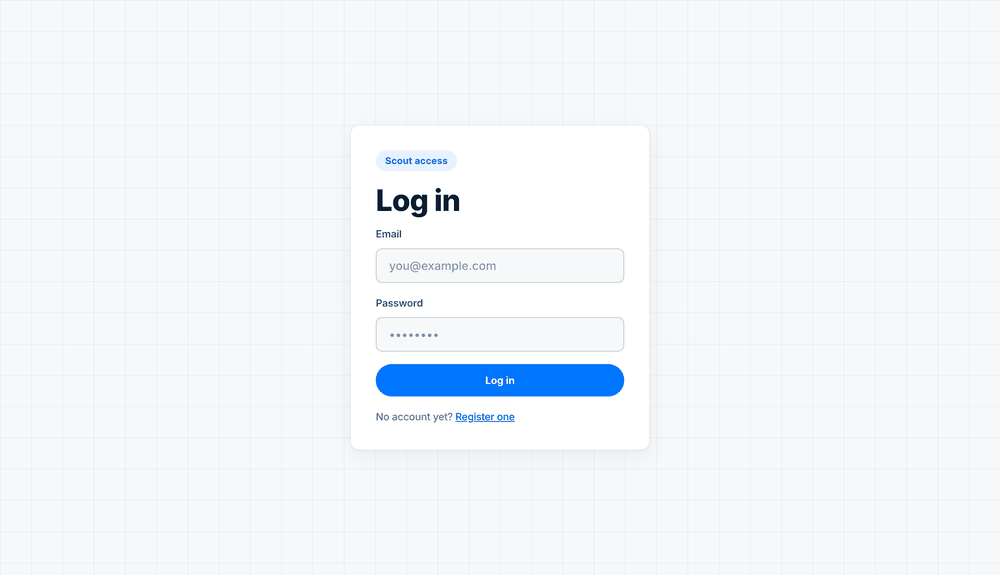

# Keepa Scout

Amazon 套利分析服务：ASIN eligibility/ROI 判定、Keepa 数据 ETL、自然语言提问与多轮上下文
AI 助手（`/chat`，LangGraph 驱动；原 `/ask` 已合并入它，见下文）、后台全量刷新
（`/refresh`，Celery + 每日定时）。

设计文档：[`ARCHITECTURE.md`](ARCHITECTURE.md)（系统架构/ER/时序图）、
[`HARNESS.md`](HARNESS.md)（每项能力的目标/验收标准/证据）。笔试题原始材料在
[`candidate_package/`](candidate_package/CHALLENGE.md)。

## 启动

```bash
cp .env.example .env
# .env 里已经填好这个环境用的 DeepSeek key；换成你自己的 LLM key/供应商也可以，
# 只要是 OpenAI 兼容接口，改 LLM_BASE_URL/LLM_MODEL 就行，不用改代码。
# Keepa key 从 candidate_package/env.example 复制。

docker compose up --build -d
# api(:8000) / worker / beat(每天 04:00 UTC 定时刷新) / db(Postgres) / broker(Redis) / frontend(:5173)
# ETL 在 api 容器启动时自动跑一次(python -m app.etl)，读 data/sample_asins.csv
```

一键跑全部验收：

```bash
./scripts/verify_all.sh
```

题目要求的两个验收脚本可以单独跑：`./scripts/verify_chat.py`（`/chat` 多轮场景，
含真实 `docker compose restart api`）、`./scripts/verify_refresh_resume.sh`（`/refresh`
断点续跑，含真实 `docker compose kill worker`）。

**已知环境限制**：本仓库开发/验证过程中所在的沙箱连不上 `api.keepa.com`（DNS 解析到
一个网络测试用的哨兵地址，不是本项目的 bug）。所以下面 `/upc`、ETL 的真实 Keepa 数据是
在具备正常网络的环境下才能验证；本仓库里跑的所有 `/eligibility`/`/chat` 示例，
底层数据是一批**灌进真实 ETL 管线（`app/ingest.py`）的合成 fixture**（不是手造的假 JSON
响应），标题带 "Synthetic Dev Fixture Item" 字样可辨认。DeepSeek（LLM）在这个环境里是能
连通的，所有 `/chat` 示例都是真实模型调用产生的结果，不是 mock。

## 鉴权（强制，无匿名回退——见 ARCHITECTURE.md 顶部说明）

```bash
curl -X POST localhost:8000/auth/register \
  -H "Content-Type: application/json" \
  -d '{"email":"you@example.com","password":"correcthorse"}'
# -> {"access_token":"...","expires_at":"..."}  (24h 有效，注册即自动登录)

TOKEN=<上面拿到的 access_token>
```

下面所有端点都要带 `-H "Authorization: Bearer $TOKEN"`。

## 端点

### `GET /upc`

```bash
curl "localhost:8000/upc?upc=70537500052" -H "Authorization: Bearer $TOKEN"
# -> {"input":"70537500052","normalized":["70537500052","070537500052"],"asins":[...]}
```

### `GET /eligibility/{asin}`

```bash
curl localhost:8000/eligibility/B00HEON30Y -H "Authorization: Bearer $TOKEN"
```

### `POST /eligibility/batch`（加分项）

```bash
curl -X POST localhost:8000/eligibility/batch -H "Authorization: Bearer $TOKEN" \
  -H "Content-Type: application/json" \
  -d '{"asins":["B00HEON30Y","DOES_NOT_EXIST","B001FB5MBK"]}'
# 按输入顺序返回；查不到的项是 {"asin":"DOES_NOT_EXIST","error":"not_found"}，不是 500
```

### `POST /refresh` + `GET /refresh/status`

```bash
curl -X POST localhost:8000/refresh -H "Authorization: Bearer $TOKEN"
# -> {"job_id":"...","state":"running","total":32,"done":0}
curl localhost:8000/refresh/status -H "Authorization: Bearer $TOKEN"
```

### 自然语言提问（原 `POST /ask`——已移除，改经 `/chat`）

> **主动的题面偏离**（详见 ARCHITECTURE.md 开头"偏离②"）：`/ask` 在功能上是 `/chat` 的
> 严格子集（同一套 NL→SQL 安全校验、同一个执行入口，但无多轮/无状态/无偏好），保留两条
> 并行管线只有维护成本。端点已整体移除；题目 7 类示例问题全部改经 `/chat` 提问，效果相同
> 且引用真实数据。SQL 安全校验（SELECT-only/单语句/禁 DDL-DML）由
> `tests/test_tool_run_readonly_sql.py` 在工具层持续覆盖。

5 条真实跑过的示例（非题目原句的复述；`SID` 为任意新会话 id）：

```bash
SID=$(uuidgen)
curl -X POST localhost:8000/chat -H "Authorization: Bearer $TOKEN" \
  -H "Content-Type: application/json" -d "{\"session_id\":\"$SID\",\"message\":\"How many ASINs currently pass all the eligibility checks?\"}"

curl -X POST localhost:8000/chat -H "Authorization: Bearer $TOKEN" \
  -H "Content-Type: application/json" -d "{\"session_id\":\"$SID\",\"message\":\"Give me the 5 best-ROI ASINs where Amazon is not the dominant seller.\"}"

curl -X POST localhost:8000/chat -H "Authorization: Bearer $TOKEN" \
  -H "Content-Type: application/json" -d "{\"session_id\":\"$SID\",\"message\":\"Why doesn't B006JVZXJM qualify as eligible?\"}"

curl -X POST localhost:8000/chat -H "Authorization: Bearer $TOKEN" \
  -H "Content-Type: application/json" -d "{\"session_id\":\"$SID\",\"message\":\"If you had to pick one ASIN to resell right now, which would it be and why?\"}"

curl -X POST localhost:8000/chat -H "Authorization: Bearer $TOKEN" \
  -H "Content-Type: application/json" -d "{\"session_id\":\"$SID\",\"message\":\"What is the weather forecast for tomorrow?\"}"
# -> {"answer":"I can only help with Amazon ASIN arbitrage analysis.", ...}   # 域外拒答，session 状态不丢
```

### `POST /chat`

多轮示例（真实跑过，见 `candidate_package/test_evidence/phase4/chat_scenario_A.txt`）：

```bash
SID=demo-session-1
curl -X POST localhost:8000/chat -H "Authorization: Bearer $TOKEN" -H "Content-Type: application/json" \
  -d "{\"session_id\":\"$SID\",\"message\":\"Show me the ASINs that are currently eligible\"}"
# -> 16 条 eligible ASIN，session_state.active_filters={"eligible_only":true,...}

curl -X POST localhost:8000/chat -H "Authorization: Bearer $TOKEN" -H "Content-Type: application/json" \
  -d "{\"session_id\":\"$SID\",\"message\":\"OK now narrow that to ones with ROI above 25 percent\"}"
# -> 收窄到 7 条，active_filters 里 eligible_only 和 min_roi 都保留（累积，不是互相覆盖）
```

`WS /chat/stream?token=<token>` 是给前端用的流式版本，事件协议见
`app/routers/chat.py` 顶部注释。

## 前端

Vue 3 SPA，`http://localhost:5173`（`docker compose up` 已包含）。截图在
`candidate_package/test_evidence/phase5/`。

## 演示（真实数据，非 mock）



上面的 GIF 是真实浏览器（chrome-devtools 驱动）逐帧截图合成的完整走查：登录 →
`/eligibility` 单查（5 条规则逐项 pass/fail + ROI）→ 批量查询 → **`/upc` 真实 Keepa
查询**（`052144100245` → 同一 UPC 的 3 个 listing 全部返回）→ `/chat` 发问
（`build_filter_sql` 工具卡 → 流式回答逐字增长 → 对最终回答分三段下滑展示完整表格与结论，
注意侧栏标题即首条提问）→ `/refresh` 任务状态（32/32 done）。全程真实 DeepSeek + 真实
Keepa 调用（录制恰逢出网窗口开放，见上方"已知环境限制"）。

`candidate_package/test_evidence/phase7/e2e/` 是一次完整的真实浏览器端到端走查（chrome-devtools
驱动，非截图拼接），覆盖注册 → 登录 → ASIN lookup → UPC 查询 → `/chat` 两轮对话（filter →
指代消解"the first one"），全程真实 Keepa 数据、真实 DeepSeek 调用、0 个 console 报错：

| 步骤 | 截图 |
|---|---|
| 登录/注册 | `01_login.png` / `02_register_filled.png` |
| ASIN lookup（真实 Keepa 数据，"Rejected: amazon_pct" 等真实拒绝原因） | `03_asin_lookup_real_data.png` |
| UPC 查询（真实触发了 Keepa 429 限流，错误干净展示，没有崩） | `04_upc_rate_limited.png` |
| `/chat` 第一轮：`build_filter_sql` 工具调用 → 9 条真实 eligible ASIN 排名 | `05_chat_turn1_pending.png` / `06_chat_turn1_real_data.png` |
| `/chat` 第二轮："the first one" 正确指代消解到 `B0H35GBG5V`，含真实价格异常检测（当前价比 90 天均价低 83%） | `07_chat_turn2_reference_resolution.png` |

## 成本核算

```bash
python3 scripts/cost_report.py
```

## 目录结构 / 架构细节

见 [`ARCHITECTURE.md`](ARCHITECTURE.md) §5。测试：`tests/`（`pytest`，200 项）；
验收脚本：`scripts/`（黑盒，打真实 `docker compose` 栈）。
